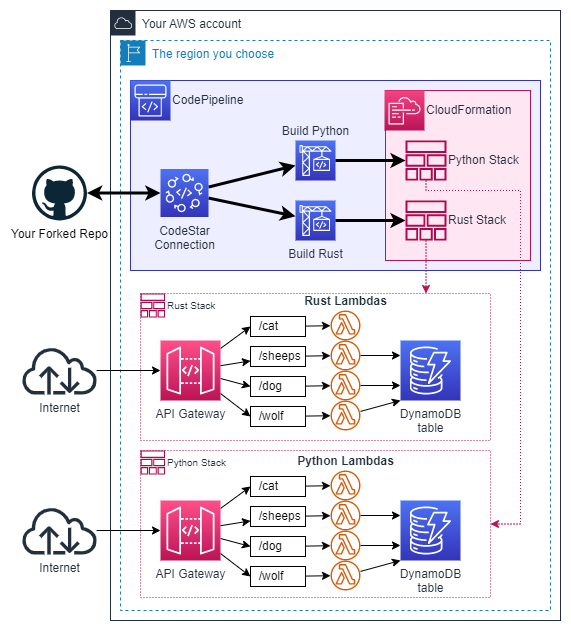

<div id="top"></div>
<!--
*** Thanks for checking out the Best-README-Template. If you have a suggestion
*** that would make this better, please fork the repo and create a pull request
*** or simply open an issue with the tag "enhancement".
*** Don't forget to give the project a star!
*** Thanks again! Now go create something AMAZING! :D
-->


<!-- PROJECT SHIELDS -->
<!--
*** I'm using markdown "reference style" links for readability.
*** Reference links are enclosed in brackets [ ] instead of parentheses ( ).
*** See the bottom of this document for the declaration of the reference variables
*** for contributors-url, forks-url, etc. This is an optional, concise syntax you may use.
*** https://www.markdownguide.org/basic-syntax/#reference-style-links
-->
[![Contributors][contributors-shield]][contributors-url]
[![Forks][forks-shield]][forks-url]
[![Stargazers][stars-shield]][stars-url]
[![Issues][issues-shield]][issues-url]
[![MIT License][license-shield]][license-url]
[![LinkedIn][linkedin-shield]][linkedin-url]


<!-- PROJECT LOGO -->
<br />
<div align="center">
  <a href="https://github.com/JeremieRodon/demo-rust-lambda">
    
  </a>

  <h3 align="center">Demo Rust on Lambda</h3>

  <p align="center">
    A demonstration of how minimal an effort it takes to use Rust instead of Python for Serverless projects<br/>such as an API Gateway with Lambda functions.
  </p>
</div>


<!-- TABLE OF CONTENTS -->
<details>
  <summary>Table of Contents</summary>
  <ol>
    <li><a href="#about-the-project">About The Project</a></li>
    <li>
      <a href="#getting-started">Getting Started</a>
      <ul>
        <li><a href="#prerequisites">Prerequisites</a></li>
        <li><a href="#preparation">Preparation</a></li>
        <li><a href="#deployment">Deployment</a></li>
        <li><a href="#cleanup">Cleanup</a></li>
      </ul>
    </li>
    <li>
      <a href="#usage">Usage</a>
      <ul>
        <li><a href="#generating-traffic-on-the-apis">Generating traffic on the APIs</a></li>
        <li><a href="#exploring-the-results-with-cloudwatch-log-insights">Exploring the results with CloudWatch Log Insights</a></li>
      </ul>
    </li>
    <li><a href="#license">License</a></li>
    <li><a href="#contact">Contact</a></li>
  </ol>
</details>

<!-- ABOUT THE PROJECT -->
## About The Project

### Functional requirements
As an example, we are creating a backend-API that models a ***Sheep Shed***.

The ***Sheep Shed*** is housing... well... **Sheeps**. Each ***Sheep*** has a ***Tatoo*** which is unique: it is a functionnal error to have sheeps sharing the same tatoo. A ***Sheep*** also have a ***Weight***, which is important down the road.

The ***Sheep Shed*** obviously has a **Dog** that can, when asked, count the sheeps in the shed.

The ***Sheep Shed*** unfortunately has a hungry **Wolf** lurking around, who wants to eat the sheeps. This wolf is quite strange, he suffers from Obsessive-Compulsive Disorder.
Even starving, he can only eat a ***Sheep*** if its ***Weight*** expressed in micrograms is a prime number. And of course, if multiple sheeps comply with his OCD he wants the heaviest one!

Finally, the ***Sheep Shed*** has a resident **Cat**. The cat does not care about the sheeps, shed, wolf or dog. He is interested only in its own business. This is a savant cat that
recently took interest in a [2-ary variant of the Ackermann function](https://en.wikipedia.org/wiki/Ackermann_function#TRS,_based_on_2-ary_function). The only way to currently get his
attention is to ask him about it.

### AWS design
The ***Sheep Shed*** is accessible through an **Amazon API Gateway** exposing 4 paths:
- POST /sheeps/`<Tatoo>` to add a sheep in the shed with the given `Tatoo` and a random weight generated by the API
- GET /dog to retrieve the current sheep count
- GET /cat?m=`<m>`&n=`<n>` to ask the cat to compute the Ackermann function for given `m` and `n`
- DELETE /wolf to trigger a raid on the shed by our OCD wolf.

Each of this path has its own **AWS Lambda** function.

The backend is an **Amazon DynamoDB** table.

### But... Why?!
Ok that's just a demo but the crux of it is:
- The **Dog** performs a task that only require to scan DynamoDB with virtually no operationnal overhead other than driving the scan pagination
- The **sheep insertion** performs a random number generation, but is also almost entirely tied to a single DynamoDB interaction (PutItem)
- The **Wolf** require to not only scan the entire DynamoDB table, but also to compute the prime numbers to be able to efficiently test if the weight of each sheep is itself a prime number
then, if a suitable sheep is found, he eats (DeleteItem) it
- The **Cat** performs a purely algorithmic task with no I/O required.

As a result, we can compare the size of the advantage of Rust over Python in this various situations.

*NB1: The DynamoDB table layout is intentionaly bad: it would be possible to create indexes to drastically accelerate the search of a suitable sheep for the wolf, but that's not the subject of
this demonstration*

*NB2: Initially I thought that activities tied to DynamoDB (Network I/O) operations would greatly reduce the advantage of Rust over Python (because
packets don't go faster between Lambda and DynamoDB depending on the language used). But it turns out that even for "pure" IO bound activities Rust
lambdas are crushing Python lambdas...*

<p align="right">(<a href="#top">back to top</a>)</p>


<!-- GETTING STARTED -->
## Getting Started

You can easily deploy the demo in you own AWS account in less than 15 minutes. The cost of deploying and loadtesting will
be less than $1: CodePipeline/CodeBuild will stay well within their Free-tier; API Gateway, Lambda and DynamoDB
are all in pay-per-request mode at an aggregated rate of ~$5/million req.

Here is an overview of what will be deployed:
<div align="center">
    
    <p><i>This PNG can be edited using <a href="https://draw.io">Draw.io</a></i></p>
</div>

### Prerequisites

You need **an existing AWS account**, with permissions to use the following services:
- AWS CodeStar Connections
- AWS CloudFormation
- AWS CodePipeline
- Amazon Simple Storage Service (S3)
- AWS CodeBuild
- AWS Lambda
- Amazon API Gateway
- Amazon DynamoDB
- AWS IAM (roles will be created for Lambda, CodeBuild, CodePipeline and CloudFormation)
- Amazon CloudWatch Logs

You also need **a GitHub account**, as the deployment method I propose here rely on you being able to fork this repository (CodePipeline only accepts source GitHub repositories that you own for obvious security reasons).

### Preparation

#### 1. Fork the repo
Fork this repository in you own GitHub account. Copy the ID of the new repository (\<UserName>/demo-rust-lambda), you will need it later. Be mindfull of the case.

The simplest technique is simply to copy it from the browser URL:


#### Important

In the following instructions, there is an *implicit* instruction to **always ensure your AWS Console
is set on the AWS Region you intend to use**. You can use any region you like, just stick to it.

#### 2. Create a CodeStar connection to your GitHub account
This step is only necessary if you don't already have a CodeStar Connection to your GitHub account. If you do, you can reuse it: just retrieve its ARN and keep it on hand.

1. Go to the CodePipeline console, select Settings > Connections, use the GitHub provider, choose any name you like, click Connect to GitHub


2. Assuming you where already logged-in on GitHub, it will ask you if you consent to let AWS do stuff in your GitHub. Yes you do.


3. You will be brought back to the AWS Console, choose the GitHub Apps that was created for you in the list (don't mind the number on the screenshot), then click Connect.


4. The connection is now created, copy its ARN somewhere, you will need it later.


### Deployment

Now you are ready to deploy, download the CloudFormation template [ci-template.yml](https://github.com/JeremieRodon/demo-rust-lambda/blob/master/ci-template.yml)
from the link or from your newly forked repository if you prefer.

1. Go to the CloudFormation console and create a new stack.


2. Ensure *Template is ready* is selected and *Upload a template file*, then specify the `ci-template.yml` template that you just downloaded.


7. Choose any Stack name you like, set your CodeStar Connection Arn (previously copied) in `CodeStarConnectionArn` and your forked repository ID in `ForkedRepoId`


8. Skip the *Configure stack options*, leaving everything unchanged

9. At the *Review and create* stage, acknowledge that CloudFormation will create roles and Submit.


At this point, everything will roll on its own, the full deployment should take ~8 minutes, largely due to the quite long first compilation of Rust lambdas.

If you whish to follow what is happening, keep the CloudFormation tab open in your browser and open another one on the CodePipeline console.

### Cleanup

To cleanup the demo resources, you need to remove the CloudFormation stacks **IN ORDER**:
- **First** remove the two API stacks named `<ProjectName>-rust-api` and `<ProjectName>-python-api`
- **/!\\ Wait until both are successfully removed /!\\**
- **Then** remove the CICD stack (the one you created yourself)

You **MUST** follow that order of operation because the CICD stack owns the IAM Role used by the other two to performs their operation;
therefore destroying the CICD stack first will prevent the API stacks from operating.

Removing the CloudFormation stacks correctly will cleanup every resources created for this demo, no further cleanup is needed.

<p align="right">(<a href="#top">back to top</a>)</p>

<!-- USAGE EXAMPLES -->
## Usage

### Generating traffic on the APIs

The `utils` folder of the repository contains scripts to generate traffic on each API. The easiest way is to use `execute_default_benches.sh`:
```sh
cd utils
./execute_default_benches.sh --rust-url <RUST_API_URL> --python-url <PYTHON_API_URL>
```
*You can find the URL of each API (`RUST_API_URL` and `PYTHON_API_URL` in the script above) in the Outputs sections of the respective CloudFormation stacks or directly in the API Gateway console.*

It will execute a bunch of API calls (~40k/API) and typically takes ~10minutes to run, depending on your internet connection and latence to the APIs.

For reference, here is an execution report with my APIs deployed in the Paris region (as I live there...):
```sh
./execute_default_benches.sh \
--rust-api https://r97srvphyb.execute-api.eu-west-3.amazonaws.com/v1 \
--python-api https://qr19fdky53.execute-api.eu-west-3.amazonaws.com/v1
```
It outputs:
```
./invoke_cat.sh https://qr19fdky53.execute-api.eu-west-3.amazonaws.com/v1
Calls took 59593ms
./invoke_cat.sh https://r97srvphyb.execute-api.eu-west-3.amazonaws.com/v1
Calls took 7394ms
./insert_sheeps.sh https://qr19fdky53.execute-api.eu-west-3.amazonaws.com/v1
Insertion took 10050ms
./insert_sheeps.sh https://r97srvphyb.execute-api.eu-west-3.amazonaws.com/v1
Insertion took 6578ms
./invoke_dog.sh https://qr19fdky53.execute-api.eu-west-3.amazonaws.com/v1
Calls took 10791ms
./invoke_dog.sh https://r97srvphyb.execute-api.eu-west-3.amazonaws.com/v1
Calls took 7345ms
./invoke_wolf.sh https://qr19fdky53.execute-api.eu-west-3.amazonaws.com/v1
Calls took 245703ms
./invoke_wolf.sh https://r97srvphyb.execute-api.eu-west-3.amazonaws.com/v1
Calls took 6835ms
Done.
```

Of course, you can also play with the individual scripts of the `utils` folder, just invoke them with `--help` to see what you can do with them:
```sh
./invoke_cat.sh --help
```
```
Usage: ./invoke_cat.sh [<OPTIONS>] <API_URL>

Repeatedly call GET <API_URL>/cat?m=<m>&n=<n> with m=3 and n=8 unless overritten

-p|--parallel <task_count>      The number of concurrent task to use. (Default: 100)
-c|--call-count <count> The number of call to make. (Default: 1000)
-m <integer>    The 'm' number for the Ackermann algorithm. (Default: 3)
-n <integer>    The 'n' number for the Ackermann algorithm. (Default: 8)

OPTIONS:
-h|--help                       Show this help
```

### Exploring the results with CloudWatch Log Insights

After you generated load, you can compare the performance of the lambdas using CloudWatch Log Insights.

Go to the CloudWatch Log Insights console, set the date/time range appropriately, select the 8 log groups of our Lambdas (4 Rust, 4 Python) and set the query:


Here is the query:
```
filter @type = "REPORT"
| parse @log /^\d+:.*?-(?<Lambda>(rust|python)-.+)$/
| stats avg(@duration) as avgDuration, min(@duration) as minDuration, max(@duration) as maxDuration, stddev(@duration) as StdDevDuration,
avg(@billedDuration) as avgBilled, min(@billedDuration) as minBilled, max(@billedDuration) as maxBilled, stddev(@billedDuration) as StdDevBilled,
avg(@maxMemoryUsed / 1024 / 1024) as avgRam, min(@maxMemoryUsed / 1024 / 1024) as minRam, max(@maxMemoryUsed / 1024 / 1024) as maxRam, stddev(@maxMemoryUsed / 1024 / 1024) as StdDevRam
by Lambda
```

And here are the results yielded by my tests (Duration: ms, Billed: ms, Ram: MB):

---
| Lambda |-| avgDuration | minDuration | maxDuration | StdDevDuration |-| avgBilled | minBilled | maxBilled | StdDevBilled |-| avgRam | minRam | maxRam | StdDevRam |
| --- |-| --- | --- | --- | --- |-| --- | --- | --- | --- |-| --- | --- | --- | --- |
| rust-delete-wolf-ocd |-| 98.4841 | 42.28 | 252.96 | 42.7561 |-| 103.265 | 43 | 316 | 56.47 |-| 24.2996 | 20.9808 | 28.6102 | 1.3404 |
| python-delete-wolf-ocd |-| 5192.4109 | 2327.6 | 9604.31 | 1999.5336 |-| 5192.9096 | 2328 | 9605 | 1999.5262 |-| 89.3961 | 78.2013 | 102.9968 | 3.9763 |
| rust-get-dog-count |-| 21.8582 | 12.24 | 107.07 | 15.031 |-| 25.204 | 13 | 170 | 27.309 |-| 24.1432 | 20.9808 | 28.6102 | 1.9002 |
| python-get-dog-count |-| 801.4529 | 594.16 | 2317.02 | 450.1134 |-| 801.962 | 595 | 2318 | 450.1113 |-| 76.4656 | 73.4329 | 80.1086 | 1.3878 |
| rust-post-sheep-random |-| 11.797 | 4.59 | 96.42 | 12.2931 |-| 14.274 | 5 | 158 | 22.6726 |-| 23.3488 | 20.0272 | 25.7492 | 1.3674 |
| python-post-sheep-random |-| 753.5861 | 527.47 | 2226.41 | 458.3725 |-| 754.077 | 528 | 2227 | 458.3716 |-| 76.2463 | 59.1278 | 81.0623 | 2.1591 |
| rust-get-cat-ackermann |-| 127.2334 | 67.19 | 785.56 | 24.9678 |-| 129.12 | 92 | 786 | 25.7485 |-| 16.1037 | 14.3051 | 20.9808 | 1.4747 |
| python-get-cat-ackermann |-| 5768.7616 | 5662.51 | 6071.9 | 34.6346 |-| 5769.25 | 5663 | 6072 | 34.6466 |-| 33.3643 | 31.4713 | 40.0543 | 1.7757 |
---

Kind of speaks for itself, right?

<p align="right">(<a href="#top">back to top</a>)</p>


<!-- LICENSE -->
## License

Distributed under the MIT License. See `LICENSE.txt` for more information.

<p align="right">(<a href="#top">back to top</a>)</p>

<!-- CONTACT -->
## Contact

Jérémie RODON - [@JeremieRodon](https://twitter.com/JeremieRodon) - jeremie.rodon@gmail.com

Project Link: [https://github.com/JeremieRodon/demo-rust-lambda](https://github.com/JeremieRodon/demo-rust-lambda)

<p align="right">(<a href="#top">back to top</a>)</p>

<!-- MARKDOWN LINKS & IMAGES -->
<!-- https://www.markdownguide.org/basic-syntax/#reference-style-links -->
[contributors-shield]: https://img.shields.io/github/contributors/JeremieRodon/demo-rust-lambda.svg?style=for-the-badge
[contributors-url]: https://github.com/JeremieRodon/demo-rust-lambda/graphs/contributors
[forks-shield]: https://img.shields.io/github/forks/JeremieRodon/demo-rust-lambda.svg?style=for-the-badge
[forks-url]: https://github.com/JeremieRodon/demo-rust-lambda/network/members
[stars-shield]: https://img.shields.io/github/stars/JeremieRodon/demo-rust-lambda.svg?style=for-the-badge
[stars-url]: https://github.com/JeremieRodon/demo-rust-lambda/stargazers
[issues-shield]: https://img.shields.io/github/issues/JeremieRodon/demo-rust-lambda.svg?style=for-the-badge
[issues-url]: https://github.com/JeremieRodon/demo-rust-lambda/issues
[license-shield]: https://img.shields.io/github/license/JeremieRodon/demo-rust-lambda.svg?style=for-the-badge
[license-url]: https://github.com/JeremieRodon/demo-rust-lambda/blob/master/LICENSE.txt
[linkedin-shield]: https://img.shields.io/badge/-LinkedIn-black.svg?style=for-the-badge&logo=linkedin&colorB=555
[linkedin-url]: https://linkedin.com/in/j%C3%A9r%C3%A9mie-rodon-b6656290
